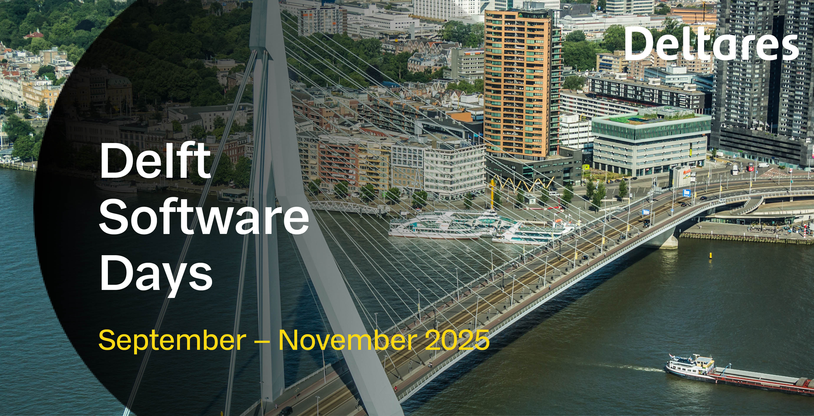

# Course Description
The purpose of this 1-day workshop is to introduce participants to recent additions and advanced simulation capabilities of MODFLOW 6. For each topic included in the training, there will be a short lecture on the underlying concepts and implementation, a live demonstration or exercise, or both. These exercises will use the Python language, Jupyter Notebooks, and the FloPy Package to create, run, and post-process MODFLOW 6 simulations.

# Getting Started
Instructions for setting up the class environment is provided in [setup.md](./setup.md).

# Agenda

* 08:30 to 09:00 &mdash; **ARRIVAL** 
* 09:00 to 09:10 &mdash; Welcome and Introductions (MR)
* 09:10 to 09:40 &mdash; Overview of MODFLOW 6, newest capabilities, and ongoing developments (MR/CL)
* 09:40 to 10:40 &mdash; Brief introduction to FloPy and pixi, installation of the class environment (JH/MR)
* 10:40 to 11:00 &mdash; **COFFEE BREAK**
* 11:00 to 12:30 &mdash; In-depth density driven flow, adaptive timestepping, advection schemes, SWI (CL/ST)
* 12:30 to 12:55 &mdash; Highlights: new and advanced features such as PRT, NetCDF, gridded input, ... (MR/CL)
* 12.55 to 13.00 &mdash; **GROUP PICTURE**
* 13:00 to 14:00 &mdash; **LUNCH BREAK**
* 14:00 to 15:30 &mdash; Aquifer Thermal Energy Storage (ATES/WKO) example using GWE (MB)
* 15:30 to 15:50 &mdash; **COFFEE BREAK**
* 15:50 to 16:50 &mdash; In-depth Numerical Solution: solver settings, diagnostics, best practices (JH/MR)
* 16:50 to 17:00 &mdash; Closing (MR)
* **DRINKS** &mdash; 17:00 to 18:00
